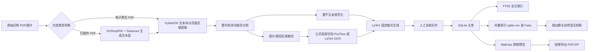

# 本地可搜索可组卷试卷题库系统实施研究

## 执行摘要

这个项目**可行，而且很适合先做一个“个人本地、非商业、尽量零成本”的版本**。对你当前目标而言，最稳妥的主线不是一开始就上“大而全”的 AI，而是先把**结构化存储、稳定导入、可搜索、可预览、可导出**打通，再逐步叠加 OCR、相似题检索、自然语言检索和自动解析生成。SQLite 已内置 JSON 功能，并通过 FTS5 提供全文检索；FTS5 还支持外部内容表、前缀索引、`highlight()`/`snippet()` 等能力，因此非常适合作为个人本地题库的主库与全文索引层。对于语义相似题，本地可以用 Sentence Transformers 生成向量，再用 sqlite-vec、Faiss 或 Chroma 之一做向量检索；其中 sqlite-vec 的优势是“仍然留在 SQLite 单文件体系里”，Faiss 的优势是成熟、稳、适合更大规模向量检索。citeturn3view1turn2view0turn30view0turn30view1turn30view2turn30view3turn33view0turn33view1turn28view0turn31view2

对你这种**本地单机、个人自用**场景，我建议的首选架构是：**SQLite 作为唯一事实主库 + 文件系统存图片与原始试卷 + FTS5 做全文搜索 + MathJax 做网页预览 + PyMuPDF 做 PDF 页裁切与缩略图 + Flask 先做本地 Web 界面**。等 MVP 稳定后，再决定是否封装成 Electron 桌面应用。Flask 本身是轻量级 WSGI Web 框架，适合快速起步；Electron 则适合在后期把 Web UI 打包成跨平台桌面软件。citeturn8view0turn9view0turn9view1

对导入而言，**电子原生 PDF** 和 **扫描件 PDF** 应走两条分支：扫描件先用 OCRmyPDF + Tesseract 生成可检索文本层；包含公式和图形题时，再用 Pix2Text 或 LaTeX-OCR 处理公式或局部区域。OCRmyPDF 的官方文档明确说明它会为 PDF 图像加入文本层、使扫描 PDF 可搜索，并且对“扫描图像 PDF”和“born digital PDF”都较为宽容；但它也明确提醒，Tesseract 对手写体、双栏阅读顺序、差扫描质量等场景存在局限。对于复杂数学公式，Pix2Text 把自己定位为 Mathpix 的开源替代，支持版面、表格、公式 LaTeX 与文本识别；LaTeX-OCR 则专注“把公式图像转成 LaTeX 代码”。citeturn29view0turn29view1turn7view0turn11view0turn11view3turn11view4turn34view1

从你当前上传的样本看，已经有一个很适合作为**第一批试点语料**的多年真题合集 PDF，可先围绕它建立**年份、试卷名、题号、题型、题干 LaTeX、图片路径、原貌截图、答案与解析**这一套最小闭环，再扩展到任意试卷自动导入。fileciteturn0file0

## 可行性评估与边界

### 技术可行性

从纯技术上看，这个系统没有明显“做不到”的环节，难点主要在**自动化精度**与**工程取舍**，不是在底层能力缺失上。SQLite FTS5 能提供本地全文检索；JSON 功能默认内置，JSONB 自 3.45 起可减少 JSON 解析开销，但 SQLite 也明确说明 JSONB 在大多数操作下仍是 `O(N)`，因此**高频过滤字段不应只埋在 JSON 里**，而应拆成普通列。citeturn2view0turn3view1turn3view0

向量检索也可本地完成。Sentence Transformers 文档说明：对语义检索，要先把查询和语料编码到同一向量空间；对于小语料，官方给出的经验是**大约百万条以内**可以直接手工实现语义搜索；如果要更进一步，则可以接 ANN 索引。Faiss 官方仓库则明确说明它是面向**稠密向量高效相似搜索与聚类**的库，支持 CPU/GPU、多种索引结构与不同规模向量集合。citeturn3view3turn31view2turn28view0turn3view4

题目预览并不需要把 LaTeX 重新编成整份 PDF 才能看到。MathJax 可以在现代浏览器中直接渲染 LaTeX/MathML/AsciiMath，并且公式是文本而不是位图，能搜索、可缩放、可打印；PyMuPDF 则能打开 PDF、提取页面图片、裁切页面区域，甚至生成页面 `pixmap`，非常适合做“题目原貌截图”和“原页定位”。citeturn9view3turn15view2turn16view2

### 法律与版权风险

如果系统**仅个人本地学习使用、不共享、不自动向他人提供题库下载或在线访问**，风险通常低于公网题库或多人共享系统；但这不等于“没有版权风险”。你未来设想中的“自动导入任意试卷”“AI 读取数据库”“模糊搜索相似题”，一旦演变成**局域网共享、网盘分发、公开网页访问、导出整卷分发**，就可能触及向公众提供作品的法律边界。中国《著作权法》最近一次修订日期是 2020 年 11 月 11 日；与在线共享最相关的一个权能是信息网络传播权，即“以有线或者无线方式向公众提供作品，使公众可以在其个人选定的时间和地点获得作品”的权利。citeturn26search0turn35search3

因此，这个项目在法律上最稳妥的边界是：**只处理你合法取得的材料；只做个人本地整理；不提供整卷原 PDF 或整套图片对外分发；如果未来需要共享，则尽量共享你自己生成的标签、索引、解析和教学性再加工内容，而不是原始试卷的整页复刻。**这部分属于合规建议，不是法律意见。citeturn26search0turn35search3

### 资源需求与主要风险点

资源上，MVP 并不重。核心存储用 SQLite，代码层用 Python，界面先用 Flask，本地预览用浏览器即可；这些都属于轻量方案。真正吃资源的是三类任务：**扫描件 OCR、数学公式识别、本地大模型推理**。Tesseract 5 支持 100 多种语言与 35+ script；EasyOCR 也支持 80+ 语言，适合作为备选 OCR 引擎。citeturn7view0turn34view1

真正的项目风险主要在以下几项。第一，**题目切分错误**，尤其是一题跨页、图形滞后出现、答案与题干混排。第二，**公式识别误差**，特别是含上下标、矩阵、分段函数、图形标注的题目。第三，**OCR 低质量输入**，OCRmyPDF 官方明确指出 Tesseract 无法识别手写、可能识别出乱码、对双栏和阅读顺序不稳定。第四，**“只有结构化 LaTeX，没有原貌截图”会导致组卷时用户体验差**，所以原貌预览必须从第一版就考虑。第五，**sqlite-vec 目前仍是 pre-v1**，适合实验与轻量项目，但要预期潜在 breaking changes。citeturn29view1turn33view1

### 未指定项与扩展原则

下列条件在你的需求中目前**未指定**，因此系统设计应保留扩展位，而不要写死：

| 未指定项 | 当前处理建议 | 扩展做法 |
|---|---|---|
| 试卷语言 | 默认 `zh-CN`，字段中保留 `language_code` | 后续可按语言切 tokenizer / embedding model |
| 题型范围 | 先按“选择、填空、解答、证明、作图、附加题”建通用枚举 | 再增加 `subtype`、`options_json`、`proof_required` |
| 题量规模 | 先按个人本地 1 份到数万题设计 | 超过十万题后再把语义检索从“精确/轻 ANN”升级到 Faiss/Lucene 组合 |
| 手写题识别 | 默认**不纳入 MVP** | 如未来涉及手写体，单独引入手写 OCR/视觉模型；不要指望 OCRmyPDF/Tesseract 直接解决，因为其官方文档明确指出不支持手写识别。 citeturn29view1 |

## 分阶段实施路线

我建议把项目分成五个阶段推进。先把“数据库与索引模型”定死，再做导入；先保证**人工可校正**，再追求“全自动”。

### 路线总览



该流程中，大部分组件都有现成本地开源实现：PyMuPDF 负责 PDF 页面与图片处理；OCRmyPDF 使用 Tesseract 给扫描件 PDF 加文本层；Sentence Transformers 负责本地语义向量；MathJax 负责前端公式渲染。citeturn15view2turn29view2turn29view1turn31view2turn9view3

### 阶段表

| 阶段 | 目标 | 输入 / 输出 | 关键技术与工具 | 核心步骤 | 粗略时间 | 验收标准 | 备选方案 |
|---|---|---|---|---|---|---|---|
| 数据模型与存储 | 定义稳定 ID、字段、文件结构、主库模式 | 输入：题库需求；输出：SQLite DDL、目录规范、ID 规则 | SQLite + JSON + FTS5。SQLite 的 JSON 默认内置，FTS5 支持外部内容表与前缀索引。citeturn3view1turn30view0turn30view3 | 先定义 `source_papers`、`questions`、`question_assets`、`question_embeddings` 等表，再定义 FTS5 与触发器 | 2–4 天 | 能插入、更新、删除题目并自动同步全文检索 | 若后续需要更强向量能力，可保留 Faiss sidecar |
| 试卷解析与导入 | 实现“1 份 PDF -> 一批题目记录”的流水线 | 输入：PDF/图片；输出：结构化题目、图片裁切、复核队列 | PyMuPDF、OCRmyPDF、Tesseract、EasyOCR、Pix2Text、LaTeX-OCR。citeturn15view2turn29view0turn7view0turn34view1turn11view0turn11view3 | 文档判别、块提取、题号切分、图片关联、公式 OCR、固定 LaTeX 生成、低置信度入队 | 5–10 天做电子原生 PDF；再加 7–14 天补扫描件 | 单份试卷人工复核后，题号完整率、图片关联率、可预览率达到可用 | 扫描件过难时先只入“原貌截图+纯文本”，延期 LaTeX 化 |
| 搜索与索引 | 支持按年份、卷别、题型、关键词、相似题检索 | 输入：已入库题目；输出：关键词搜索、过滤搜索、相似题搜索 | FTS5 / Whoosh / Lucene；向量侧用 sqlite-vec、Faiss 或 Chroma。Whoosh 是纯 Python；Lucene 是高性能 Java 搜索库；Faiss 做高效向量搜索；sqlite-vec 能在 SQLite 中做纯 SQL KNN。citeturn13view0turn13view2turn28view0turn33view0turn13view3 | 建全文索引、建向量索引、实现混合召回、结果高亮与筛选器 | 3–6 天 | 年份/卷别过滤准确；关键词可高亮；相似题 Top-K 结果基本合理 | 先只做 FTS5，向量检索放第二期 |
| 组卷与原貌预览 | 组卷时看到人类可读题面与原貌截图，而非只看 LaTeX | 输入：题目记录；输出：浏览器预览、临时试卷、PDF/ZIP 导出 | MathJax、PyMuPDF、Typst、Flask / Electron。MathJax 可浏览器渲染公式；Typst 编译到 PDF/HTML；Electron 可打包桌面端。citeturn9view3turn9view2turn8view0turn9view0 | 题目卡片、原貌截图切换、试卷篮、模板版式、导出 PDF/ZIP | 5–8 天 | 能拖拽组卷、批量导出、点击查看原貌、导出文件可打印 | 如 PDF 排版过慢，先导出 HTML + PDF 打印 |
| 后续 AI 功能 | 自动解析、自然语言检索、相似题推荐、辅助审核 | 输入：结构化题库；输出：解析草稿、智能搜索、推荐列表 | Sentence Transformers、llama.cpp、本地量化模型。Sentence Transformers 官方提供语义检索流程；llama.cpp 支持本地量化推理。citeturn31view2turn32view0 | 先做“检索增强，而非纯生成”；所有 AI 输出默认进复核 | 7–21 天，按功能逐项上线 | AI 结果均带“机器生成/待审核”标记；用户可一键采纳或退回 | 若本地模型效果差，再评估外部 API，但要单独评估成本与隐私 |

## 数据模型与文件组织规范

### 推荐的主库与文件布局

对于你的场景，我推荐**SQLite 作为唯一主库**。原因很直接：单文件、零服务器、可直接随项目备份；JSON 功能默认内置；FTS5 可与内容表联动；SQLite 本体与文档还是 public domain。citeturn3view1turn2view0turn12view0

推荐目录结构如下：

```text
exam-bank/
├─ app/
│  ├─ ingest/
│  ├─ index/
│  ├─ preview/
│  ├─ export/
│  └─ web/
├─ data/
│  ├─ raw/
│  │  └─ gaokao-math/
│  │     └─ 1977_2024/
│  │        └─ 1977—2024高考数学真题全编(1).pdf
│  ├─ db/
│  │  └─ question_bank.sqlite3
│  ├─ assets/
│  │  ├─ question_images/
│  │  │  └─ GK-MATH-1977-BJ-LI/
│  │  │     ├─ Q001/
│  │  │     │  ├─ stem_01.png
│  │  │     │  ├─ fig_01.png
│  │  │     │  └─ thumb.png
│  │  └─ paper_pages/
│  │     └─ source-paper-id/
│  ├─ cache/
│  │  ├─ ocr/
│  │  ├─ latex_render/
│  │  └─ embeddings/
│  └─ exports/
│     ├─ html/
│     ├─ pdf/
│     └─ zip/
├─ logs/
├─ scripts/
└─ README.md
```

这个结构的关键原则有两条。第一，**数据库只存索引与结构化字段，不把整张图片二进制硬塞进主表**；图片与缩略图放文件系统，库里只存相对路径。第二，**原貌与规范化并存**：既保存 `stem_latex`，也保存 `raw_crop_path` 与 `page_bbox_json`。这样你在组卷时可以同时看到“渲染版题面”和“原始截图版题面”。

### 题目字段设计

建议把题目对象拆成“高频过滤列 + 低频扩展元数据 JSON”两层。因为 SQLite 虽然支持 JSON/JSONB，但 JSONB 并没有神奇地把所有查询变成 `O(1)`；高频筛选字段仍应落到普通列。citeturn3view0

| 字段 | 类型 | 是否必填 | 说明 |
|---|---|---:|---|
| `id` | INTEGER PK | 是 | 数据库内部自增主键 |
| `qid` | TEXT UNIQUE | 是 | 稳定题目 ID，例如 `GK-MATH-1977-BJ-LI-Q001` |
| `language_code` | TEXT | 是 | 默认 `zh-CN`，未指定时仍显式保存 |
| `subject` | TEXT | 是 | 例如 `数学` |
| `year` | INTEGER | 否 | 来源年份；未指定允许为空 |
| `paper_name` | TEXT | 否 | 例如 `1977 普通高等学校招生考试 北京卷理` |
| `source_paper_id` | INTEGER | 是 | 指向原始试卷表 |
| `region` | TEXT | 否 | 省份/全国卷名 |
| `stream` | TEXT | 否 | 文 / 理 / 新高考 / 未指定 |
| `question_no` | TEXT | 是 | 题号，可保留 `附加题-1` 等形式 |
| `question_type` | TEXT | 否 | 选择、填空、解答、证明、作图等 |
| `stem_latex` | TEXT | 是 | 固定格式 LaTeX 源码 |
| `stem_text` | TEXT | 是 | 去公式噪声后的可检索纯文本 |
| `answer_text` | TEXT | 否 | 标准答案或简答答案 |
| `analysis_latex` | TEXT | 否 | 解析、点评、解法 |
| `difficulty` | INTEGER | 否 | 1–5 或空 |
| `tags_json` | TEXT/JSON | 否 | 例如 `["导数","函数单调性","压轴"]` |
| `image_refs_json` | TEXT/JSON | 否 | 关联图片路径数组或对象 |
| `raw_crop_path` | TEXT | 否 | 题目原貌截图路径 |
| `page_range` | TEXT | 否 | 例如 `p012-p013` |
| `bbox_json` | TEXT/JSON | 否 | 原 PDF 中的页面坐标 |
| `ocr_confidence` | REAL | 否 | OCR 或公式识别平均置信度 |
| `review_status` | TEXT | 是 | `pending / reviewed / approved / rejected` |
| `meta_json` | TEXT/JSONB | 否 | 低频元数据、导入日志、规则分数 |
| `content_hash` | TEXT | 是 | 去重用哈希 |
| `created_at` | TEXT | 是 | ISO 时间戳 |
| `updated_at` | TEXT | 是 | ISO 时间戳 |

### 建表 DDL 示例

下面给的是**可直接落地的 SQLite 方案**。主表与全文索引表分离，让 FTS5 用外部内容表；这样能避免重复存储太多文本，同时方便用触发器维护一致性。SQLite 官方文档明确支持 FTS5 external content tables，并建议通过触发器保持同步。citeturn30view0

```sql
PRAGMA foreign_keys = ON;

CREATE TABLE source_papers (
    id              INTEGER PRIMARY KEY AUTOINCREMENT,
    paper_code      TEXT NOT NULL UNIQUE,
    title           TEXT NOT NULL,
    year            INTEGER,
    subject         TEXT NOT NULL DEFAULT '数学',
    language_code   TEXT NOT NULL DEFAULT 'zh-CN',
    source_path     TEXT NOT NULL,
    page_count      INTEGER,
    import_mode     TEXT NOT NULL,         -- born_digital / scanned / mixed
    meta_json       TEXT DEFAULT '{}',
    created_at      TEXT NOT NULL DEFAULT CURRENT_TIMESTAMP
);

CREATE TABLE questions (
    id               INTEGER PRIMARY KEY AUTOINCREMENT,
    qid              TEXT NOT NULL UNIQUE,
    source_paper_id  INTEGER NOT NULL REFERENCES source_papers(id) ON DELETE CASCADE,
    language_code    TEXT NOT NULL DEFAULT 'zh-CN',
    subject          TEXT NOT NULL DEFAULT '数学',
    year             INTEGER,
    region           TEXT,
    stream           TEXT,
    paper_name       TEXT,
    question_no      TEXT NOT NULL,
    question_type    TEXT,
    stem_latex       TEXT NOT NULL,
    stem_text        TEXT NOT NULL,
    answer_text      TEXT,
    analysis_latex   TEXT,
    difficulty       INTEGER CHECK (difficulty BETWEEN 1 AND 5),
    tags_json        TEXT DEFAULT '[]',
    image_refs_json  TEXT DEFAULT '[]',
    raw_crop_path    TEXT,
    page_range       TEXT,
    bbox_json        TEXT DEFAULT '{}',
    ocr_confidence   REAL,
    review_status    TEXT NOT NULL DEFAULT 'pending',
    meta_json        TEXT DEFAULT '{}',
    content_hash     TEXT NOT NULL,
    created_at       TEXT NOT NULL DEFAULT CURRENT_TIMESTAMP,
    updated_at       TEXT NOT NULL DEFAULT CURRENT_TIMESTAMP
);

CREATE INDEX idx_questions_year       ON questions(year);
CREATE INDEX idx_questions_paper      ON questions(paper_name);
CREATE INDEX idx_questions_qtype      ON questions(question_type);
CREATE INDEX idx_questions_review     ON questions(review_status);
CREATE INDEX idx_questions_source     ON questions(source_paper_id);

CREATE TABLE question_search_content (
    question_id      INTEGER PRIMARY KEY REFERENCES questions(id) ON DELETE CASCADE,
    qid              TEXT NOT NULL,
    year_text        TEXT,
    paper_name       TEXT,
    question_type    TEXT,
    tags_text        TEXT,
    stem_text        TEXT,
    answer_text      TEXT,
    analysis_text    TEXT
);

CREATE VIRTUAL TABLE question_fts USING fts5(
    qid UNINDEXED,
    year_text UNINDEXED,
    paper_name,
    question_type,
    tags_text,
    stem_text,
    answer_text,
    analysis_text,
    content='question_search_content',
    content_rowid='question_id',
    prefix='2 3 4'
);

CREATE TRIGGER trg_q_ai AFTER INSERT ON questions BEGIN
  INSERT INTO question_search_content (
      question_id, qid, year_text, paper_name, question_type,
      tags_text, stem_text, answer_text, analysis_text
  ) VALUES (
      NEW.id, NEW.qid, COALESCE(CAST(NEW.year AS TEXT), ''),
      COALESCE(NEW.paper_name, ''), COALESCE(NEW.question_type, ''),
      COALESCE(json_extract(NEW.tags_json, '$'), ''),
      NEW.stem_text, COALESCE(NEW.answer_text, ''), COALESCE(NEW.analysis_latex, '')
  );

  INSERT INTO question_fts(rowid, qid, year_text, paper_name, question_type, tags_text, stem_text, answer_text, analysis_text)
  VALUES (
      NEW.id, NEW.qid, COALESCE(CAST(NEW.year AS TEXT), ''),
      COALESCE(NEW.paper_name, ''), COALESCE(NEW.question_type, ''),
      COALESCE(json_extract(NEW.tags_json, '$'), ''),
      NEW.stem_text, COALESCE(NEW.answer_text, ''), COALESCE(NEW.analysis_latex, '')
  );
END;

CREATE TRIGGER trg_q_ad AFTER DELETE ON questions BEGIN
  DELETE FROM question_search_content WHERE question_id = OLD.id;
  INSERT INTO question_fts(question_fts, rowid, qid, year_text, paper_name, question_type, tags_text, stem_text, answer_text, analysis_text)
  VALUES ('delete', OLD.id, OLD.qid, CAST(OLD.year AS TEXT), OLD.paper_name, OLD.question_type,
          json_extract(OLD.tags_json, '$'), OLD.stem_text, OLD.answer_text, OLD.analysis_latex);
END;

CREATE TRIGGER trg_q_au AFTER UPDATE ON questions BEGIN
  UPDATE question_search_content
     SET qid = NEW.qid,
         year_text = COALESCE(CAST(NEW.year AS TEXT), ''),
         paper_name = COALESCE(NEW.paper_name, ''),
         question_type = COALESCE(NEW.question_type, ''),
         tags_text = COALESCE(json_extract(NEW.tags_json, '$'), ''),
         stem_text = NEW.stem_text,
         answer_text = COALESCE(NEW.answer_text, ''),
         analysis_text = COALESCE(NEW.analysis_latex, '')
   WHERE question_id = NEW.id;

  INSERT INTO question_fts(question_fts, rowid, qid, year_text, paper_name, question_type, tags_text, stem_text, answer_text, analysis_text)
  VALUES ('delete', OLD.id, OLD.qid, CAST(OLD.year AS TEXT), OLD.paper_name, OLD.question_type,
          json_extract(OLD.tags_json, '$'), OLD.stem_text, OLD.answer_text, OLD.analysis_latex);

  INSERT INTO question_fts(rowid, qid, year_text, paper_name, question_type, tags_text, stem_text, answer_text, analysis_text)
  VALUES (
      NEW.id, NEW.qid, COALESCE(CAST(NEW.year AS TEXT), ''),
      COALESCE(NEW.paper_name, ''), COALESCE(NEW.question_type, ''),
      COALESCE(json_extract(NEW.tags_json, '$'), ''),
      NEW.stem_text, COALESCE(NEW.answer_text, ''), COALESCE(NEW.analysis_latex, '')
  );
END;
```

### 向量索引表设计

如果你选择 **sqlite-vec**，可以把向量也装回 SQLite 体系里；它支持纯 SQL、无额外服务器，但仍是 pre-v1。citeturn33view0turn33view1

```sql
-- 需先 load sqlite-vec 扩展
CREATE VIRTUAL TABLE question_vec USING vec0(
    question_id INTEGER PRIMARY KEY,
    embedding   float[384]
);
```

如果你选择 **Faiss**，更建议把向量索引放在 `data/cache/embeddings/faiss.index`，同时在 SQLite 中保留 `question_id -> vector_rowid -> model_name -> updated_at` 的映射表。这样主库仍然稳，向量索引可以单独重建。

### 示例记录

下面是一个**示意性**记录，不引用任何真实题库全文，只展示字段组织方式：

| qid | year | paper_name | question_no | question_type | stem_latex | tags_json | image_refs_json | raw_crop_path | review_status |
|---|---:|---|---|---|---|---|---|---|---|
| `GK-MATH-2024-NATL-A-Q012` | 2024 | `全国甲卷` | `12` | `解答题` | `已知函数 $f(x)=x^2-2x+1$，求其最小值。` | `["函数","最值"]` | `[]` | `assets/question_images/GK-MATH-2024-NATL-A/Q012/thumb.png` | `approved` |
| `GK-MATH-1977-BJ-LI-Q008` | 1977 | `北京卷理` | `8` | `解答题` | `某船以固定速度向正东航行，……求距离。` | `["解三角形","应用题"]` | `["fig_01.png"]` | `assets/question_images/GK-MATH-1977-BJ-LI/Q008/thumb.png` | `reviewed` |

## 试卷导入流程与算法

### 工具选型与职责分工

在导入这一步，不建议让一个工具“包打天下”。最稳的做法是**分层处理**：PDF 结构由 PyMuPDF；扫描 OCR 由 OCRmyPDF/Tesseract 或 EasyOCR；公式识别交给 Pix2Text / LaTeX-OCR；最终统一进入人工复核。各工具的角色可以这样分：

| 工具 | 适合做什么 | 优点 | 注意事项 |
|---|---|---|---|
| PyMuPDF | 打开 PDF、获取文本块、提取图片、裁切页面区域、生成缩略图 | 对 PDF 页面、图片与裁切操作非常直接。citeturn15view0turn15view2turn16view2 | 不是 OCR，本身不解决扫描文字识别 |
| OCRmyPDF | 给扫描 PDF 叠加文本层、保留原 PDF 结构 | 会给图像 PDF 增加文本层，并对扫描件和 born-digital PDF 都较宽容。citeturn29view0turn29view2 | 依赖 Tesseract；官方明确列出手写、双栏、阅读顺序等局限。citeturn29view1 |
| Tesseract | 通用 OCR 引擎 | 开源、Apache 2.0，支持命令行/API、100+ 语言与 35+ script。citeturn7view0 | 数学公式与复杂版式不是强项 |
| EasyOCR | 作为 OCR 备选，尤其适合图片区域识别 | 80+ 语言、直接给框和置信度。citeturn34view1turn34view0 | 对纯数学排版仍不如专门公式方案 |
| Pix2Text | 版面、表格、公式 LaTeX、文本识别 | 官方自述为 Mathpix 的开源替代，支持 80+ 语言。citeturn11view0turn11view2 | 适合局部区域或复杂页面，不宜盲目整页替代所有流程 |
| LaTeX-OCR | 单个公式图片转 LaTeX | 专注公式，命令行/API 都能用。citeturn11view3turn11view4 | 官方 README 明示结果必须人工 double check。citeturn11view4 |

### 导入算法建议

导入算法最容易失败的地方不是 OCR，而是**题目分割**。建议采用“先页内块分割，再基于题号规则合并”的方式，而不是直接整页 OCR 后做正则乱切。

推荐算法如下：

1. **文档预处理**  
   先判断 PDF 是否有文本层。若无文本层或文本层过少，则先进入 OCRmyPDF 分支，生成可搜索 PDF/A。OCRmyPDF 官方说明它会在原 PDF 上集成 OCR 数据，并尽量保留原内容。citeturn29view1

2. **页面结构抽取**  
   用 PyMuPDF 获取每页文本块、图片列表、页面尺寸与可裁切坐标。官方示例展示了 `pymupdf.open()`、`page.get_images()`、`Page.get_pixmap()` 等基本能力。citeturn15view0turn15view2turn16view2

3. **题号锚点识别**  
   在文本块级别用正则识别题号，如 `^\d+\.`、`^\(\d+\)`、`^附加题`、`^第[一二三四五六七八九十]+题`。  
   对数学卷，建议引入“题号序列规则”，如一页出现 `7.`、`8.`、`9.` 极可能是题目起始，而不是步骤编号。

4. **跨块与跨页合并**  
   若某题开始于页底、下一页无新题号且段落首行缩进延续，则合并至上一题。  
   对解答题，需要把“题干 + 小问 + 图形说明”整体收进同一题目。

5. **图片/图形关联**  
   从题目 bbox 向下或向右寻找最近图片区；如果图片落在题目 bbox 内，直接绑定；如果题目提到“如图”，却未关联到图片，则自动加入复核队列。

6. **公式细分识别**  
   对局部公式或 OCR 置信度低的块，单独裁成图片送 Pix2Text 或 LaTeX-OCR；同时保留原始截图路径，不要只保留识别后的 LaTeX。citeturn11view0turn11view4

7. **固定 LaTeX 规范化**  
   把最终题干统一包成你自己的模板，比如：  
   `\questionstem{...}`、`\questionimage{...}`、`\questionanswer{...}`。  
   这样以后无论导出 Typst、HTML 还是 PDF，转换链条都固定。

8. **规则校验与人工复核**  
   触发复核的条件建议包括：  
   `ocr_confidence < 阈值`、题号不连续、图片未关联、LaTeX 编译失败、公式识别次数过多、题目跨页但未闭合。

### 可执行脚本架构

推荐的脚本分层如下：

```text
app/
├─ ingest/
│  ├─ classify_input.py       # 判断 born_digital / scanned / mixed
│  ├─ pdf_blocks.py           # PyMuPDF 提取文本块、图片、坐标
│  ├─ ocr_pdf.py              # OCRmyPDF/Tesseract 分支
│  ├─ split_questions.py      # 题号检测、跨页合并
│  ├─ crop_assets.py          # 题目截图、图形截图
│  ├─ formula_ocr.py          # Pix2Text / LaTeX-OCR
│  ├─ normalize_latex.py      # 统一成固定 LaTeX 模板
│  └─ import_to_sqlite.py     # 写入主库
├─ index/
│  ├─ build_fts.py
│  ├─ build_embeddings.py
│  └─ build_vector_index.py
├─ preview/
│  ├─ render_mathjax.py
│  └─ render_thumb.py
└─ web/
   ├─ app.py
   └─ review_ui.py
```

### 关键代码片段示例

#### 用 PyMuPDF 提取页面块与图片

```python
from __future__ import annotations

from dataclasses import dataclass
from pathlib import Path
import fitz  # PyMuPDF


@dataclass
class PageBlock:
    page_no: int
    bbox: tuple[float, float, float, float]
    text: str


def extract_blocks(pdf_path: str) -> list[PageBlock]:
    results: list[PageBlock] = []
    doc = fitz.open(pdf_path)
    for page_no, page in enumerate(doc, start=1):
        for block in page.get_text("blocks"):
            x0, y0, x1, y1, text, *_ = block
            clean = (text or "").strip()
            if clean:
                results.append(PageBlock(page_no, (x0, y0, x1, y1), clean))
    return results


def crop_region(pdf_path: str, page_index: int, bbox: tuple[float, float, float, float], out_path: str) -> None:
    doc = fitz.open(pdf_path)
    page = doc[page_index]
    rect = fitz.Rect(*bbox)
    pix = page.get_pixmap(clip=rect, dpi=200)
    Path(out_path).parent.mkdir(parents=True, exist_ok=True)
    pix.save(out_path)
```

#### 题号切分伪代码

```python
QUESTION_PATTERNS = [
    r"^\d+\.",         # 1. 2. 3.
    r"^\(\d+\)",       # (1) (2)
    r"^附加题",
]

def is_question_anchor(text: str) -> bool:
    return any(re.match(p, text.strip()) for p in QUESTION_PATTERNS)

def split_questions(blocks):
    questions = []
    current = None

    for blk in blocks:
        if is_question_anchor(blk.text):
            if current:
                questions.append(current)
            current = {"start_page": blk.page_no, "blocks": [blk]}
        elif current:
            current["blocks"].append(blk)

    if current:
        questions.append(current)

    return merge_cross_page_questions(questions)
```

#### 写入 SQLite 的导入器

```python
import hashlib
import json
import sqlite3
from datetime import datetime


def stable_hash(*parts: str) -> str:
    m = hashlib.sha256()
    for p in parts:
        m.update((p or "").encode("utf-8"))
        m.update(b"\n")
    return m.hexdigest()


def insert_question(conn: sqlite3.Connection, q: dict) -> int:
    content_hash = stable_hash(
        q["paper_name"], q["question_no"], q["stem_latex"], json.dumps(q.get("image_refs", []), ensure_ascii=False)
    )
    now = datetime.utcnow().isoformat(timespec="seconds")

    cur = conn.execute(
        """
        INSERT INTO questions (
            qid, source_paper_id, language_code, subject, year, region, stream, paper_name,
            question_no, question_type, stem_latex, stem_text, answer_text, analysis_latex,
            difficulty, tags_json, image_refs_json, raw_crop_path, page_range, bbox_json,
            ocr_confidence, review_status, meta_json, content_hash, created_at, updated_at
        ) VALUES (?, ?, ?, ?, ?, ?, ?, ?, ?, ?, ?, ?, ?, ?, ?, ?, ?, ?, ?, ?, ?, ?, ?, ?, ?, ?)
        """,
        (
            q["qid"], q["source_paper_id"], q.get("language_code", "zh-CN"), q.get("subject", "数学"),
            q.get("year"), q.get("region"), q.get("stream"), q["paper_name"],
            q["question_no"], q.get("question_type"), q["stem_latex"], q["stem_text"],
            q.get("answer_text"), q.get("analysis_latex"), q.get("difficulty"),
            json.dumps(q.get("tags", []), ensure_ascii=False),
            json.dumps(q.get("image_refs", []), ensure_ascii=False),
            q.get("raw_crop_path"), q.get("page_range"),
            json.dumps(q.get("bbox", {}), ensure_ascii=False),
            q.get("ocr_confidence"), q.get("review_status", "pending"),
            json.dumps(q.get("meta", {}), ensure_ascii=False),
            content_hash, now, now
        )
    )
    return int(cur.lastrowid)
```

### 人工复核界面建议

复核界面建议做成**左右双栏**：

- 左侧：原 PDF 页截图 + 当前题 bbox 高亮 + 关联图片缩略图  
- 右侧：结构化字段表单  
  - 题号  
  - 题型  
  - 题干纯文本  
  - 题干 LaTeX  
  - 答案  
  - 解析  
  - 标签  
  - OCR/公式置信度  
  - “通过 / 退回 / 需重切分 / 需重识别公式”

这一步非常关键。原因是 LaTeX-OCR 官方 README 本身就提醒要人工核对；OCRmyPDF 也明确列出 OCR 引擎的先天限制。**只要你准备做长期题库，复核界面一定不是奢侈品，而是主流程的一部分。**citeturn11view4turn29view1

## 搜索、组卷与原貌预览

### 搜索方案比较

#### 结构化与全文搜索层

| 方案 | 优点 | 缺点 | 结论 |
|---|---|---|---|
| SQLite + FTS5 | 单文件、本地零服务；支持 MATCH、外部内容表、前缀索引、`highlight()`、`snippet()`。citeturn2view0turn30view0turn30view1turn30view2turn30view3 | 中文分词需要你自己补 tokenizer 或预分词策略 | **首选** |
| Whoosh | 纯 Python，可移植，不需要编译器或 Java。citeturn13view0turn13view1 | 生态较老，性能与维护性不如更主流方案 | 可做纯 Python 备选 |
| Lucene | 高性能、全功能搜索库，支持结构化检索、全文检索、向量近邻与建议词。citeturn13view2 | Java 体系较重，对个人本地项目过度工程化 | 不建议作为首版 |

对你这个项目，**年份/卷别/题型/标签**天然适合走结构化字段过滤，**题干/答案/解析关键字**走 FTS5，最终组成“结构化过滤 + 全文匹配”的混合查询。FTS5 的 `highlight()` 和 `snippet()` 非常适合做搜索结果摘要。citeturn30view1turn30view2

#### 向量检索层

| 方案 | 优点 | 缺点 | 适用判断 |
|---|---|---|---|
| sqlite-vec | 仍留在 SQLite 生态；纯 SQL、无服务器；支持 `vec0` 表做 KNN。citeturn33view0turn33view2 | 目前 pre-v1，需预期 breaking changes。citeturn33view1 | 想极简、单文件时可选 |
| Faiss | 成熟、向量搜索强、支持多种索引与 CPU/GPU。citeturn28view0turn3view4 | 需要维护 sidecar index 文件，不是单库方案 | **更稳的生产化本地选择** |
| Chroma | 面向 AI 的开源数据基础设施，Python 客户端与 client-server 模式都方便。citeturn13view3turn13view4 | 对“个人单机题库”来说有些偏重 | 未来做 RAG/Agent 可考虑 |

我的建议是：

- **MVP**：先不要上独立向量库，只做 SQLite + FTS5。  
- **第二阶段**：如果你希望真正支持“找类似题”，再加 Sentence Transformers + Faiss。  
- **极简全 SQLite 信仰版**：可以试 sqlite-vec，但要接受版本迭代风险。citeturn31view2turn33view1turn28view0

### 索引更新策略

增量更新建议这样做：

1. `questions` 主表新增/修改/删除时，触发 FTS5 同步。SQLite 官方对 external content tables 的建议就是用触发器维护一致性。citeturn30view0  
2. embeddings 不必实时更新。可以做成：
   - `needs_embedding = 1`
   - 后台批处理生成向量
   - 向量写入 `question_vec` 或 Faiss sidecar
3. 相似题结果可以做缓存表：
   - `question_neighbors(question_id, neighbor_id, score, model_name, updated_at)`

如果题库总体小于几十万题，更新频率又不高，这种“结构化主库 + 异步向量索引”足够稳。

### 查询示例

#### 按年份与卷别过滤

```sql
SELECT qid, paper_name, question_no, question_type
FROM questions
WHERE year = 2024
  AND paper_name LIKE '%甲卷%'
ORDER BY question_no;
```

#### FTS5 关键词检索并高亮

```sql
SELECT
  q.qid,
  q.paper_name,
  q.question_no,
  highlight(question_fts, 4, '<mark>', '</mark>') AS stem_hit
FROM question_fts
JOIN questions q ON q.id = question_fts.rowid
WHERE question_fts MATCH '导数 AND 单调性'
  AND q.year BETWEEN 2018 AND 2024
ORDER BY bm25(question_fts), q.year DESC;
```

#### sqlite-vec 相似题查询

```sql
SELECT question_id, distance
FROM question_vec
WHERE embedding MATCH :query_embedding
ORDER BY distance
LIMIT 10;
```

#### Faiss 查询示意

```python
import faiss
import numpy as np

index = faiss.read_index("data/cache/embeddings/question.faiss")
q = np.array([query_embedding], dtype="float32")
D, I = index.search(q, k=10)
```

### 组卷与原貌预览实现

“组卷过程中看到题目原貌，而不是只看 LaTeX”这一点，最好的做法不是二选一，而是**双视图并存**：

- **视图 A：规范化渲染视图**  
  `stem_latex + 图片路径 -> HTML -> MathJax 渲染`
- **视图 B：原貌截图视图**  
  `raw_crop_path -> 直接展示原始裁切图`

MathJax 官方文档说明它会把 LaTeX/MathML 渲染成高质量、可缩放、可打印且可搜索的数学内容；而 PyMuPDF 提供页面裁切与 `pixmap` 生成能力，所以双视图能在本地很自然地实现。citeturn9view3turn16view2

建议的组卷交互流程如下：

1. 左侧搜索面板：年份、试卷、题型、标签、关键词、相似题  
2. 中间结果列表：每题显示题号、来源、标签、缩略原貌、预览按钮  
3. 右侧组卷篮：可拖拽排序、删除、分栏、设分值  
4. 预览弹窗：  
   - 上半部分展示原貌截图  
   - 下半部分展示渲染后题面  
   - 可切换“仅原貌 / 仅渲染 / 双栏对照”
5. 导出：HTML、PDF、ZIP 三种

### 导出建议

| 导出格式 | 实现方式 | 用途 |
|---|---|---|
| HTML | Flask 模板 + MathJax | 预览、快速检查、浏览器打印 |
| PDF | Typst 或 LaTeX 编译 | 正式组卷、打印成卷 |
| ZIP | `paper.pdf + manifest.json + assets/` | 备份、迁移、离线分发给自己 |

Typst 官方文档说明其编译器可把 Typst 语言文件编译为 PDF、HTML 等格式，而且语言与编译器都是开源的；所以它很适合做“本地无云依赖”的现代排版后端。citeturn9view2

### 本地前端技术栈建议

| 技术栈 | 优势 | 劣势 | 建议 |
|---|---|---|---|
| Flask + 现代前端 | 起步最快；Python 一套代码就能连数据库、导入器、搜索接口；Flask 本身就是轻量框架。citeturn8view0 | 原生桌面感一般 | **首版推荐** |
| Electron | 可把同一套 HTML/JS/CSS 打包成 Windows/macOS/Linux 桌面软件。citeturn9view0turn9view1 | 安装包更大，工程更复杂 | 等 MVP 稳定后再封装 |

结论很明确：**先 Flask，后 Electron**。

## 后续 AI 功能路线

### 自动生成解析

自动解析最容易做，但也最容易“看上去会了，实际上胡说”。所以建议把它放在**第四优先级**，在题目导入、搜索、预览都稳定之后再做。

本地实现路线是：

1. 先检索相关题、答案、同标签题  
2. 把当前题目的结构化字段与检索上下文拼成 prompt  
3. 调本地 LLM 生成“解析草稿”  
4. 强制标记 `analysis_source = 'ai_draft'`  
5. 人工审核后再转成正式解析

如果希望完全离线，可以用 `llama.cpp`。其官方仓库说明它的目标是在多种本地硬件上以尽量少的依赖做 LLM 推理，并支持多种低比特量化，这正适合个人本地应用。citeturn32view0turn32view1

### 相似题推荐

相似题推荐是 AI 功能里**最值得优先做**的，因为它对题库价值提升大、风险比“自动解析”低。推荐路线是：

- 先做 `stem_text + tags + question_type` 的拼接文本
- 用 Sentence Transformers 编码
- 用 Faiss 或 sqlite-vec 检索 Top-K
- 前端展示“相似度 + 来源 + 原貌缩略图”
- 用户可以一键加入当前试卷篮

Sentence Transformers 文档明确区分了**对称语义检索**与**非对称语义检索**；“找类似题”本质上更接近对称语义检索，而“自然语言问一句话找相关试题”更接近非对称检索。官方也建议在非对称场景中分别用 `encode_query()` 与 `encode_document()`。citeturn3view3turn31view2

### 自然语言检索接口

自然语言检索可以按三步做：

1. 结构化过滤解析：  
   例如“找 2021 年全国卷导数压轴题”，先抽出 `year=2021`、`paper_name~全国卷`、`tag~导数`  
2. 关键词/向量混合召回：  
   走 FTS5 + embeddings 双路  
3. 结果整合与解释：  
   告诉用户“因为这些题在标签、题型、语义上接近，所以排序靠前”

这一步其实不需要先上大模型。对很多输入，简单规则 + 召回排序就足够了。只有当你想支持非常自由的问法时，才需要本地模型把自然语言转成过滤条件和向量查询。

### AI 审核辅助

除了“生成”，AI 更实用的用途其实是“审核”：

- 检测题干是否缺图  
- 检测答案与题型是否不匹配  
- 检测公式是否可能识别错  
- 检测同题重复导入  
- 检测题号序列异常

这类功能可以完全基于规则与轻量模型，不必等大模型。

## 实施清单与优先级

### 数据库、搜索与向量方案对比

| 类别 | 方案 | 关键能力 | 许可 / 成熟度 | 我的建议 |
|---|---|---|---|---|
| 主库存储 | SQLite | 单文件、本地、JSON 内置、FTS5 可用。citeturn3view1turn2view0 | Public domain。citeturn12view0 | **必须选** |
| 全文搜索 | SQLite FTS5 | MATCH、前缀索引、外部内容表、`highlight()`、`snippet()`。citeturn30view0turn30view1turn30view2turn30view3 | 稳定成熟 | **首选** |
| 全文搜索备选 | Whoosh | 纯 Python、无需 Java。citeturn13view0 | 老牌但较旧 | 不建议首版 |
| 企业级搜索 | Lucene | 高性能、全功能搜索与向量近邻。citeturn13view2 | 成熟，但较重 | 个人项目暂不需要 |
| 向量索引 | Faiss | 高效稠密向量搜索，支持多种索引。citeturn28view0turn3view4 | MIT，成熟。citeturn28view0 | **推荐第二阶段采用** |
| 向量索引 | sqlite-vec | 纯 SQL、无服务、可直接并入 SQLite。citeturn33view0turn33view2 | MIT/Apache-2，但 pre-v1。citeturn33view1 | 极简方案可试 |
| 向量数据库 | Chroma | 面向 AI 的开源基础设施，客户端/服务端皆可。citeturn13view3turn13view4 | Apache 2.0 | 将来若做 RAG 再考虑 |

### OCR、公式与界面工具清单

| 工具 | 用途 | 许可 | 是否推荐 |
|---|---|---|---|
| Tesseract | 基础 OCR 引擎，命令行/API，100+ 语言。citeturn7view0 | Apache 2.0。citeturn7view0 | **推荐** |
| OCRmyPDF | 扫描 PDF 转可搜索 PDF/A。citeturn29view0turn29view1 | 开源文档明确可本地用 | **推荐** |
| EasyOCR | 图片 OCR 备选，给框和置信度。citeturn34view1 | Apache-2.0。citeturn34view0 | 推荐作补充 |
| Pix2Text | 版面/表格/公式/文本一体识别。citeturn11view0 | MIT。citeturn11view2 | **强烈推荐公式场景** |
| LaTeX-OCR | 单公式图像转 LaTeX。citeturn11view3turn11view4 | MIT。citeturn11view5 | 推荐作局部补刀 |
| MathJax | 浏览器预览公式。citeturn9view3 | 开源 | **推荐** |
| Flask | 本地 Web UI。citeturn8view0 | BSD-3-Clause。citeturn8view0 | **首版推荐** |
| Electron | 本地桌面封装。citeturn9view0 | 开源 | 第二期再考虑 |
| llama.cpp | 本地 LLM 推理。citeturn32view0 | MIT。citeturn32view1 | 做 AI 时再上 |

### 最低硬件建议

下面是偏保守的个人本地建议值，目的是“能跑起来”：

| 场景 | 最低建议 |
|---|---|
| 仅 SQLite + FTS5 + 浏览器预览 | 4 核 CPU、8GB 内存、20GB 可用磁盘 |
| 加扫描 OCR 与图片裁切 | 4–8 核 CPU、16GB 内存更稳 |
| 加本地 embeddings 批处理 | 16GB 内存更舒服 |
| 加本地 LLM 生成解析 | 16–32GB 内存更现实；若有 GPU 更好。`llama.cpp` 支持多种低比特量化，能显著降低内存需求。citeturn32view0 |

### 优先级任务清单

建议你按下面顺序做，而不是同时开十个坑：

| 优先级 | 任务 | 说明 |
|---|---|---|
| P0 | 定义目录结构与 SQLite DDL | 这是后面所有自动化的地基 |
| P0 | 实现单份 PDF 手工半自动导入 | 先能导入 1 份卷，不追求全自动 |
| P0 | 做题目卡片预览 | 必须同时看到 MathJax 渲染版与原貌截图 |
| P1 | 实现年份/卷别/题型/关键词搜索 | 先做 FTS5，别急着上向量 |
| P1 | 做复核界面 | 没有复核界面，导入质量很快失控 |
| P1 | 做组卷篮与 HTML/PDF 导出 | 先组合、预览、打印 |
| P2 | 增加扫描件 OCR 流程 | 解决任意来源 PDF |
| P2 | 增加向量检索与相似题 | 真正支持“找类似题” |
| P3 | AI 自动解析草稿 | 一定要带审核流 |
| P3 | 自然语言检索 | 做用户体验升级，而不是最先投入 |

### 最终建议

如果你现在就要开工，我会建议你把第一版范围严格限制成下面这句话：

**“用 SQLite + FTS5 + PyMuPDF + Flask + MathJax，把你当前这份多年真题 PDF 里的题目导入成带年份/卷别索引、可搜索、可预览原貌、可手动组卷导出的本地题库。”** 这一步完成后，后面的 OCR 扩展、任意试卷自动入库、相似题推荐和 AI 解析，都会变成在稳定地基上的增量功能，而不是一开始就把问题做成一个不可控的大杂烩。citeturn2view0turn30view0turn9view3turn15view2turn8view0turn31view2